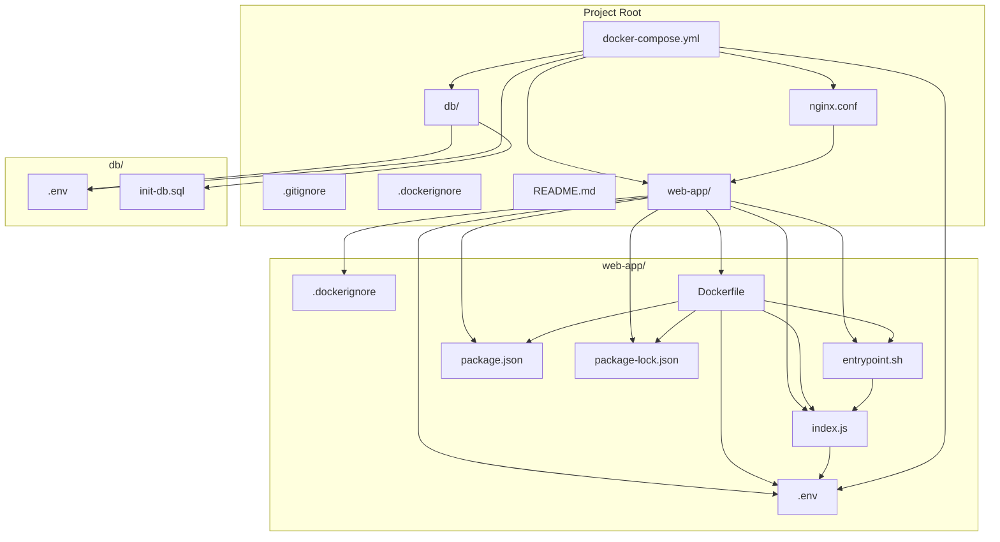

# Partner Support Engineer Assessment – Project Report

## 1. Project Overview

### Provided files for the web app.
- docker-compose.yml defining all services.
- nginx configuration file.
- sample SQL script for database initialization.
- dockerfile
- shell entrypoint script
- index.js JSFile
- package.json file

The project demonstrates a full-stack Dockerized application with:
- A Node.js/Express web app
- A PostgreSQL database (with initialization script)
- An NGINX reverse proxy

It exposes a `/health` endpoint to verify database and internet connectivity.

---

## 2. Initial Setup and Problem Solving

### 📌 Workflow Overview
1. **Analyzed each of the provided files**  
   - Reviewed `Dockerfile`, `docker-compose.yml`, `index.js`, `nginx.conf`, and `init-db.sql`.
   - Understood how each component connects in the stack (Postgres, Node.js, Nginx).

2. **Understood structure and how they work**  
   - **Web App (Node.js)** → connects to DB and exposes API on port 3000.  
   - **Database (Postgres)** → stores sample data initialized via SQL.  
   - **Proxy (Nginx)** → routes requests from port 80 → web-app-service:3000.  

#### Diagram: File and Service Relationships



---

### 🔧 Troubleshooting & Fixes

#### Environment Variables
- Found **hardcoded values** in code (`process.env` expected `.env` but none was provided).
- **Fix:** Added proper `.env` files and injected them via `docker-compose.yml`.

#### Docker Compose Issues
- **Syntax:** version `'3.8'` was flagged on older Docker Compose.
- **Fix:** Adjusted syntax and spacing → corrected indentation and keys.
- **Spelling:** fixed `depend_on` → `depends_on`.
- **Update:** ensured services (`db`, `web-app`, `proxy`) properly separated with correct env mapping.
- **Healthcheck:**
  - Problem:
    ```yaml
    test: ["CMD-SHELL", "pg_isready -U user"]
    ```
    caused Postgres to log:
    ```
    FATAL: database "user" does not exist
    ```
  - **Fix:** specify correct DB:
    ```yaml
    test: ["CMD-SHELL", "pg_isready -U user -d appdb"]
    ```

#### Database & SQL
- **SQL syntax error:** missing comma after `id SERIAL PRIMARY KEY`.
- **Fix:** corrected `init-db.sql`:
    ```sql
    CREATE TABLE users (
      id SERIAL PRIMARY KEY,
      name VARCHAR(100)
    );
    INSERT INTO users (name) VALUES ('test');
    ```

#### Entrypoint and Build Context
- **Entrypoint copy error:**
  - `failed to solve: failed to compute cache key: ... "/entrypoint.sh": not found`
  - **Fix:** Moved `entrypoint.sh` into the `web-app` folder (Docker can only copy files inside the build context).

#### NGINX Config
- **NGINX config:** Corrected `nginx.conf` to listen on port `3000` (not `3001`) to match the Node.js app.

#### Docker Image Issues
- **Image error:**
  - Received error: `db Error failed to resolve reference "docker.io/library/postgres:alpine-arm64"`
  - **Fix:** Used the official `postgres:alpine` image.

---


## 3. Docker and Build Best Practices

### 3.1. Dockerfile Improvements
- Used a `.dockerignore` file to exclude unnecessary files from the build context.
- Copied only `package.json` and `package-lock.json` before running `npm install` to leverage Docker build cache.

### 3.2. Compose and Service Decoupling
- Each service (database, web app, proxy) is defined separately in `docker-compose.yml`.
- Used named volumes for persistent database storage.
- Exposed only necessary ports.

---

## 4. Version Control and Security

- Added a `.gitignore` file to exclude `node_modules/`, `.env`, logs, and database data from version control.
- Added a `.dockerignore` file to keep Docker images small and secure.
- Ensured no secrets or sensitive data are committed to the repository.

---

## 5. Project Structure

```
Partner_Support_Engineer_Assessment/
│
├── db/
│   ├── .env
│   └── init-db.sql
│
├── web-app/
│   ├── .env
|   ├── .dockerignore
│   ├── Dockerfile
│   ├── entrypoint.sh
│   ├── index.js
│   ├── package.json
│   └── package-lock.json
│
├── nginx.conf
├── docker-compose.yml
├── .gitignore
└── README.md
```

---

## 6. Best Practices Followed

- Used `.gitignore` and `.dockerignore` for security and efficiency.
- Pinned Docker image versions.
- Leveraged Docker build cache.
- Used environment variables for configuration.
- Provided sample `.env.example` files.
- Decoupled services using Docker Compose.
- Documented setup and usage in `README.md`.

---

## 7. Conclusion

This project demonstrates a robust, reproducible, and secure approach to deploying a Node.js/PostgreSQL application with Docker and Docker Compose.  
All best practices for development, build, and sharing have been followed, ensuring the project is ready for version control.